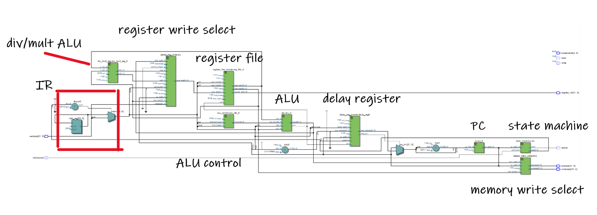

# ARMS-BIG-BROTHER

The ABB chip is a 32-bit based AVALON bus interface compatible CPU, based on a subset of the MIPS ISA architecture

ABB has the main basic sections of any CPU: State Machine, PC, IR, ALU, Register File, and Control Unit. On top of this, we have added an ALU Control Unit, Delay Register, and a div/mult ALU, register write select, and a memory write select. 

Memory is not a part of the CPU itself, instead, the CPU uses a standard Avalon Bus interface to communicate with external memory.

Excluding the control unit, clock input, and reset input, the CPU diagram has the following structure:

